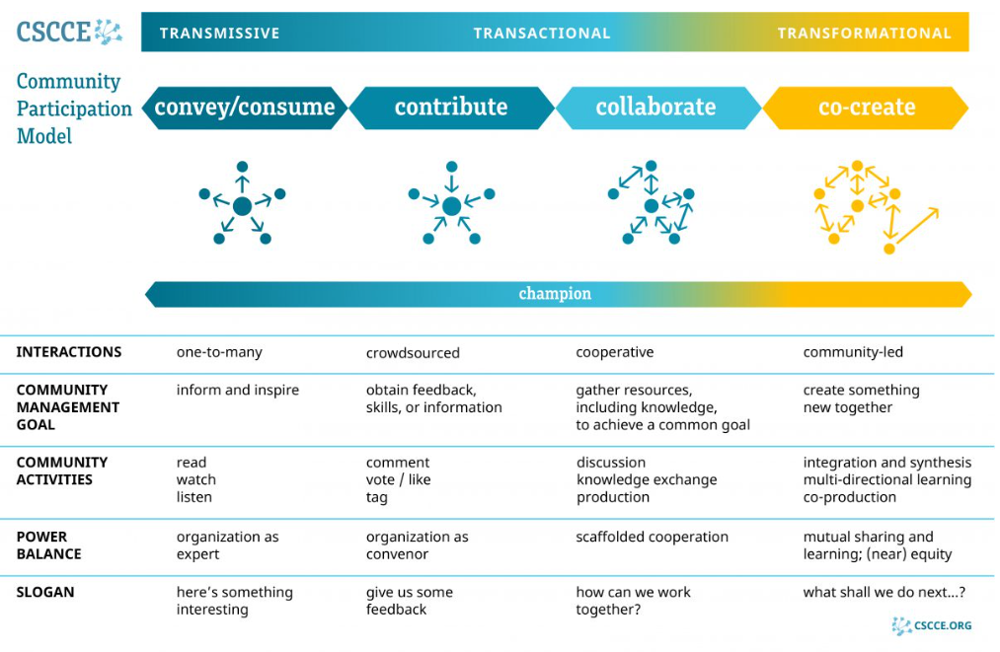

 

::: {style="color: red;"}
**🖋️ TEXT FROM program-description.md. Changed to relative file path for the embedded image.**
::: 

## Expectations of PREreview Champions    

PREreview Champions are provided with the PREreview Open Reviewers Workshop training and are expected to attend all of the virtual training sessions (with reasonable accommodations to be made where needed). The Champions’ Program Workshop differs from the standard Open Reviewers Workshop in that it focuses on providing Champions with the skills and knowledge to train others in the content. 

- Module I sets the scene with a focus on the impact of personal and structural bias in peer review.
- Module II provides more practical guidance on how to train others in providing constructive, clear, and actionable feedback to a research manuscript
- Module III focuses on event logistics and human-centered facilitation tips.   

After the training concludes, we run a number of [Live Review](https://prereview.org/live-reviews) sessions to put the knowledge gained into practice by reviewing a preprint collaboratively as a group. These sessions also include learning how to lead a collaborative review session and an opportunity to provide feedback and suggestions for improvements to the process. The collaborative review generated from the session will have a DOI, and review authors will have the option to be named and recognized in the scholarly record.    

You can find the workshop slides, collaborative notes documents, recordings, and transcripts from the training sessions in the [PREreview Champions 2026 Shared Google Drive](https://drive.google.com/drive/folders/0ABwoolrx0ViiUk9PVA). Please contact champions@prereview.org if you have any issues accessing the shared drive or any of the materials.   

After the training concludes, PREreview Champions are expected to complete at least one follow-on engagement activity by the end of September 2026. It is important to us that our Champions contribute in ways that they feel comfortable, according to their interests, skills, and the time they feel they can contribute. For this reason, the role comes with a high degree of flexibility. Follow-on activities Champions may undertake include, but are not limited to:

- Translating PREreview materials and resources into other languages
- Running an Open Reviewers training either online or in-person
- Mentoring three or more fellow researchers on how to review a preprint, with the reviews published on PREreview.org
- Organizing and facilitating one or more Live Reviews
- Creating and leading a new PREreview Club
- Organizing and/or speaking about PREreview at an in-person or virtual event
- Organizing a panel discussion about open preprint review
- Facilitating a collaboration between PREreview with another like-minded program or organization
- Helping us to run a global PREreview day where reviewers around the world get together to review preprints   

The [CSCCE Community Participation Model](https://www.cscce.org/resources/cpm/) (CPM) below is a useful tool for thinking about how different members of a community interact and describes four modes of community member participation: Convey/Consume, Contribute, Collaborate, and Co-Create, as well as a fifth “super user” mode, the Champion mode.

*Citation: Center for Scientific Collaboration and Community Engagement. (2020) The CSCCE Community Participation Model – A framework for member engagement and information flow in STEM communities. Woodley and Pratt doi:10.5281/zenodo.3997802*   

If you have any ideas for activities you would like to run, you can always contact us or your fellow Champions via [Slack](https://prereviewcommunity.slack.com/archives/C0A8747507J) or email us at champions@prereview.org to gather feedback and request any supporting materials. 
When you have completed an activity, please log the details in the [activity report form](https://bit.ly/PREreview-champions-activity-report).   

 

## What Champions can expect from PREreview

We want you as a member of our Champions team to feel comfortable and confident in representing PREreview, be this presenting at a conference, writing a blog article, or providing Open Reviewers training to early-career researchers in your community.   

To ensure you feel fully supported and valued in your role, we provide the following:

- $500 USD honorarium provided upon completion of the training and at least one engagement activity (please note that bank payments may not be possible in some countries; payments may instead be in the form of a gift voucher, please contact us if you have any concerns);
- PREreview Open Reviewers Training, including certification and digital badge of attendance;
- A copy of all workshop materials licensed CC BY 4.0, including workshop information, slides, handouts, and templates;
- Recognition on the PREreview website;
- Help with content for presentations, training, Live Reviews, and written articles;
- Personal PREreview Champion 2026 badge for use on email, website, and profile on the PREreview Slack Community;
- Being included in a supportive community of individuals who share your vision for a more open and equitable scholarly communication landscape.    

This list is not exhaustive. If you ever find that you have any questions or require assistance, you can always contact us, and we are happy to provide you with whatever support we can. Read on to find a list of resources and useful links to help you in your PREreview activities. 

 
